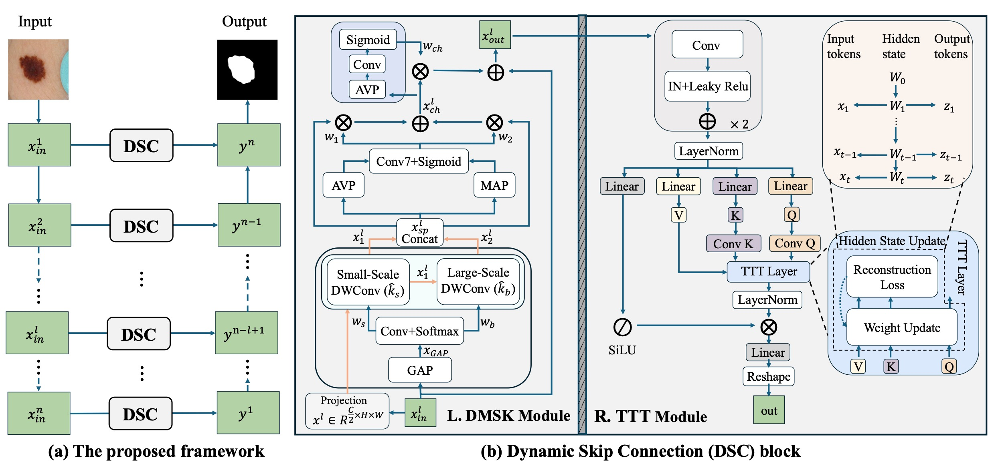

# U-like-Networks-with-Dynamic-Skip-Connections
This code is based on U-Mamba and serves as the official implementation of our paper.

## Framework

Here is the overall framework :

## Installation

The setup for our work follows the same installation and configuration as U-Mamba. Please refer to the [U-Mamba repository](https://github.com/U-Mamba/U-Mamba) for detailed setup instructions.

Follow the installation steps provided in [U-Mamba](https://github.com/U-Mamba/U-Mamba).

## Model Training

The model training process for TTT-Unet also follows the same procedures as U-Mamba. For data preparation and model training, please refer to the [U-Mamba repository](https://github.com/U-Mamba/U-Mamba).

## Inference

Inference for our models also follows U-Mamba's setup. To generate predictions, use the `nnUNetv2_predict` command with the appropriate configuration. For further details, refer to the [U-Mamba repository](https://github.com/U-Mamba/U-Mamba).

## Acknowledgements

This project is based on U-Mamba. We acknowledge all the authors of the employed public datasets, as well as the authors of [U-Mamba](https://github.com/U-Mamba/U-Mamba) and [nnU-Net](https://github.com/MIC-DKFZ/nnUNet) for making their valuable code publicly available.
